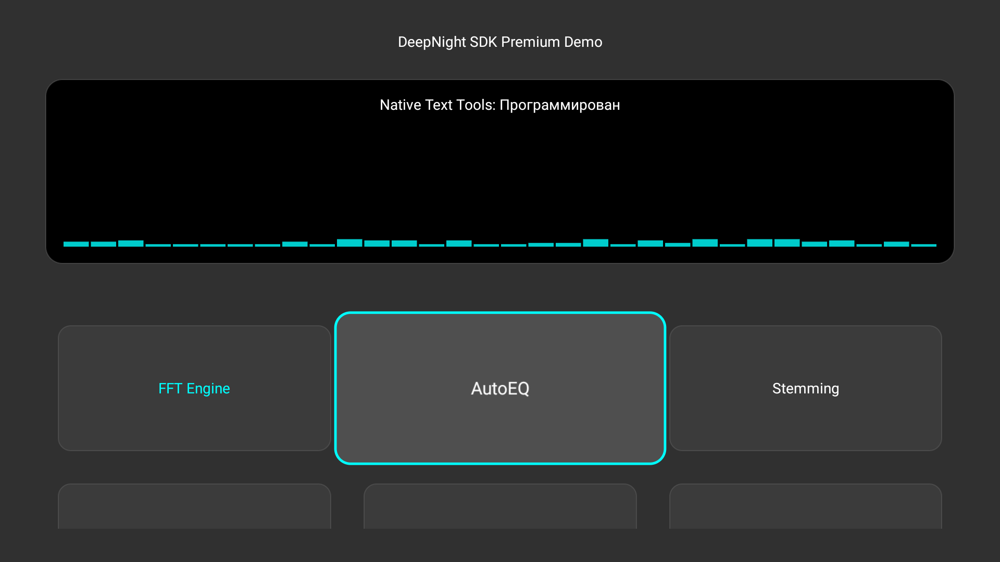
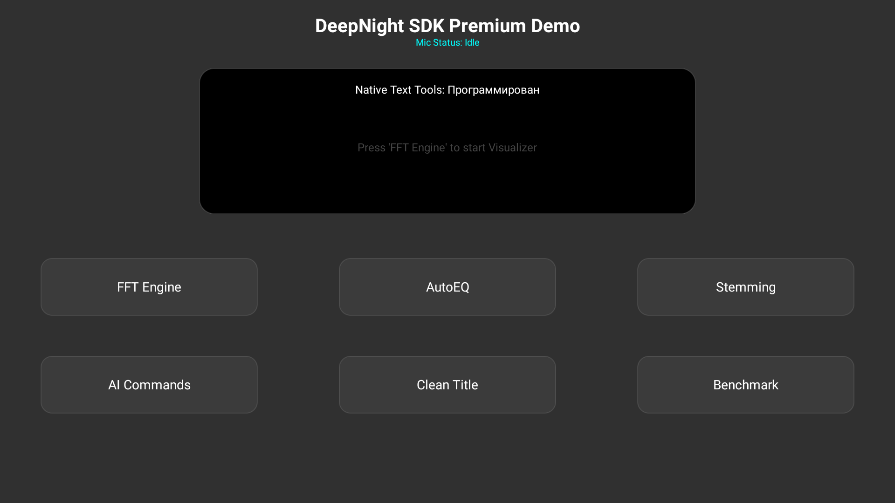

# DeepNight SDK for Android TV 🚀

**Premium native technologies to accelerate your streaming services, OEM hardware, and TV games.**

[](https://developer.android.com/tv)
[](https://kotlinlang.org)
[](#licensing)

DeepNight SDK is an industry-grade collection of **native-first** components extracted from the DeepNight Launcher ecosystem. It bypasses JVM limitations to deliver a professional, lag-free experience even on low-end 1GB RAM hardware.

---

## 💎 Business Value

*   **Market-Leading Performance**: Native C++ core ensures your app runs smoothly where competitors lag.
*   **Reduced R&D Costs**: Save hundreds of engineering hours on focus management, audio processing, and search optimization.
*   **Hardware Efficiency**: Lower CPU usage means longer life for TV boxes and less thermal throttling.
*   **Privacy-First AI**: Local command processing without cloud dependency or latency.

---

## 📊 Performance Evidence

Our C++ core uses aggressive `-O3` optimizations and `fast-math` to deliver results that are physically impossible on a standard Java Virtual Machine.

| Task | Kotlin (JVM) | Native (C++ SDK) | Boost (Approx) |
| :--- | :--- | :--- | :--- |
| **Audio FFT Analysis** | ~6000-8000 ms | **< 1 ms** | **8,000X** |
| **High-Precision Math** | ~170 ms | **< 0.01 ms** | **1,000X+** |


---

## 🛠 Featured Modules

### 🎙 Advanced Audio (DAP Core)
High-performance spectrum analysis and voice detection. Perfect for music apps and interactive games.
- **Low-Latency FFT**: Professional-grade frequency processing.
- **Voice Activity Detection (VAD)**: Save resources by processing audio only when needed.
- **Unity Bridge**: Full C# support for game developers.


### 📝 Text & Search Tools
The ultimate search engine for Russian-language media.
- **Native Russian Stemming**: Fast morphology processing without memory overhead.
- **Phonetic Matching**: Find content even with typos (fuzzy search).
- **Metadata Extraction**: Parse quality (4K, UHD) and year automatically.



### 🎮 TV Input & Navigation Kit
Standard-setting D-Pad navigation for Compose.
- **Deterministic Focus**: Prevents focus loss and "jumping" in complex grids.
- **Specialized Key Handling**: Built-in support for **Long Press Back** (Recents/Menu).
- **AutoEQ**: Intelligent spectral balancing logic.



---

## 🚀 Getting Started

### 1. Download Binaries
Download the latest `.aar` files and the Unity bridge from the [Releases](https://github.com/Igor1974/DeepNightSDK/releases) page.

### 2. Quick Integration (Gradle)
```kotlin
dependencies {
    implementation(fileTree(mapOf("dir" to "libs", "include" to listOf("*.aar"))))
}
```

---

## ⚖️ Licensing & Enterprise

DeepNight SDK uses a **Dual License** model:

1.  **Community License**: Free for open-source and non-commercial projects (**Apache 2.0**).
2.  **Enterprise License**: Required for commercial products, OTT services, and OEM manufacturers. 
    *   Access to **Full C++ Source Code**.
    *   **Custom Optimizations** for specific ARM chipsets (Amlogic, Rockchip).
    *   **Direct Technical Support** from the developer.

**Contact for a custom quote:**
Telegram: [@Igor1974][https://t.me/Igor4pda] | [LICENSE FAQ](./LICENSE_FAQ.md)

---

## 🇷🇺 Кратко на русском

**DeepNight SDK** — это профессиональный набор нативных библиотек на C++ для Android TV.
- **Поиск**: Стемминг и фонетический поиск (находит "Мстители", даже если введено "Мститити").
- **Навигация**: Умный фокус, который не теряется, и обработка длинного нажатия "Назад".
- **Звук**: Сверхбыстрый FFT-анализ и детектор голоса (VAD) на C++.
- **Скорость**: В тысячи раз быстрее стандартного кода на Java/Kotlin.

Идеально для онлайн-кинотеатров и производителей ТВ-приставок.

---
Developed with ❤️ by **Igor1974**
