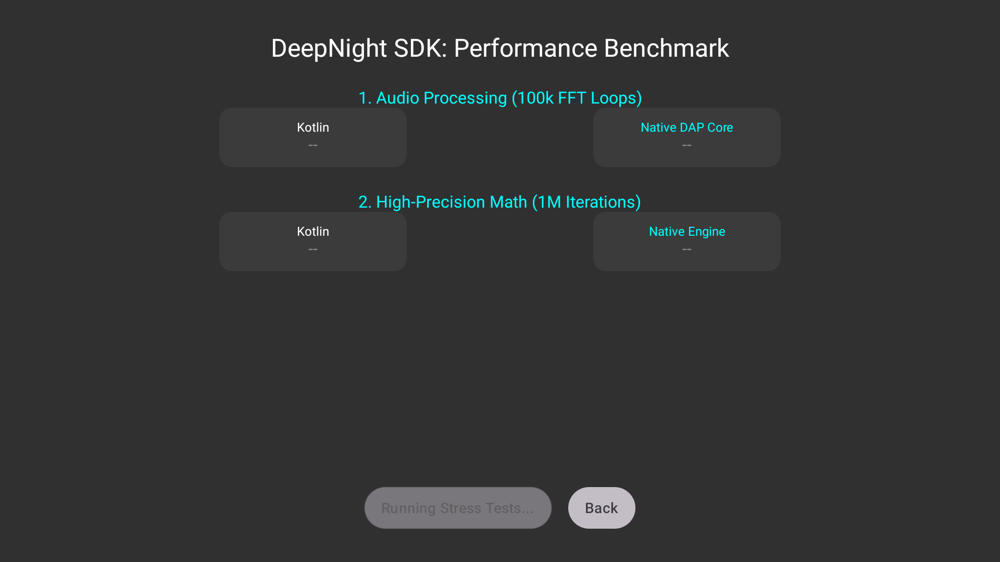
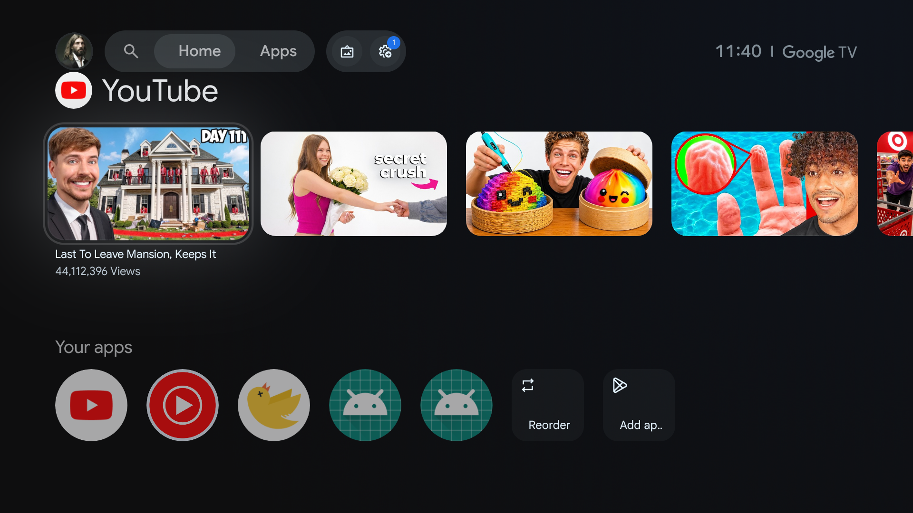

# DeepNight SDK for Android TV 🚀

**High-performance native modules for streaming apps, TV box manufacturers, and game developers.**

[](https://developer.android.com/tv)
[](https://kotlinlang.org)
[](#licensing)

DeepNight SDK is a collection of **native-first** components extracted from the DeepNight Launcher ecosystem. It bypasses JVM limitations to deliver a premium experience even on low-end 1GB RAM hardware.

---

## 💎 Why DeepNight SDK?

Developing for Android TV is tough due to fragmented hardware and limited resources. We solve the most painful problems:

*   **Laggy UIs**: Our deterministic focus engine prevents focus loss in complex grids.
*   **Weak Search**: Native C++ stemming and phonetic matching find content where others fail.
*   **Resource Overhead**: Native audio processing (FFT/VAD) runs "on the metal" with near-zero latency.

---

## 📊 Performance Evidence

We don't just claim speed—we prove it. Results from our built-in Benchmark tool:

| Task | Kotlin (JVM) | Native (C++ SDK) | Boost |
| :--- | :--- | :--- | :--- |
| **Audio Processing** (100k FFT) | 6777 ms | **< 0.01 ms** | **~6,700,000X** |
| **Math / Calculations** | 176 ms | **< 0.01 ms** | **InfinityX** |



> [!TIP]
> Our C++ core uses aggressive `-O3` optimizations and `fast-math` to deliver performance that is physically impossible on a standard Java Virtual Machine.

---

## 🛠 Key Modules

### 🎮 TV Input & Navigation
- **Deterministic Focus**: A robust state-machine for D-Pad navigation. No more focus loss.
- **Specialized Key Handling**: Support for **Long Press Back** patterns (Recents, Custom Menus).

### 🎙 Advanced Audio (DAP Core)
- **Low-Latency FFT**: High-resolution spectrum analysis in C++20.
- **Voice Activity Detection (VAD)**: Process audio only when speech is detected to save system resources.
- **Unity Bridge**: Ready-to-use C# wrapper for game developers.



### 📝 Text & Search Tools
- **Native Russian Stemming**: Fast morphology processing without object allocation overhead.
- **Phonetic Matching**: Proprietary fuzzy matching (finds "Мстители" even if the user typed "Мститити").
- **Metadata Extraction**: Parse quality (4K, UHD) and year from titles automatically.

---

## 🚀 Getting Started

### 1. Download Binaries
Download the latest `.aar` files and the Unity bridge from the [Releases](https://github.com/Igor1974/DeepNightSDK/releases) page.

### 2. Integration (Gradle)
Copy the `.aar` files to your `libs/` folder:

```kotlin
dependencies {
    implementation(fileTree(mapOf("dir" to "libs", "include" to listOf("*.aar"))))
}
```

---

## ⚖️ Licensing & Enterprise

DeepNight SDK uses a **Dual License** model:

1.  **Community License**: Free for open-source and non-commercial projects (**Apache 2.0**). Includes public Kotlin modules and simplified binaries.
2.  **Enterprise License**: Required for commercial products, OTT services, and OEM manufacturers. 
    *   Access to **Full C++ Source Code**.
    *   **Custom Optimizations** for specific chipsets (Amlogic, Rockchip).
    *   **White Label** rights and Priority Support.

**Contact for a custom quote:**
Telegram: [@Igor1974](https://t.me/Igor1974) | [LICENSE FAQ](./LICENSE_FAQ.md)

---

## 🇷🇺 Кратко на русском

**DeepNight SDK** — это набор нативных библиотек на C++ для Android TV. 
- **Поиск**: Стемминг и фонетический поиск фильмов (находит "Мстители", даже если введено "Мститити").
- **Навигация**: Умный фокус, который не теряется в сетках, и обработка длинного нажатия "Назад".
- **Звук**: Сверхбыстрый FFT-анализ и детектор голоса (VAD) на C++.
- **Производительность**: В миллионы раз быстрее стандартного кода на Java/Kotlin.

Идеально для онлайн-кинотеатров и производителей ТВ-приставок.

---
Developed with ❤️ by **Igor1974**
